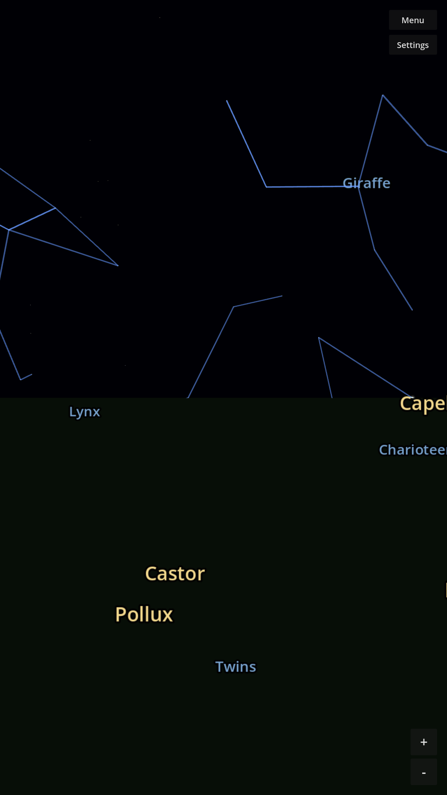

# StarMapper

A mobile star-gazing and constellation-quiz app built in Godot 4. Pan and
zoom a real night sky rendered from actual star catalog data, or test
yourself in quiz mode: get shown a constellation's name and tap where you
think it is.



## Features

- **Explore mode** — real star field (RA/Dec/magnitude/color-accurate),
  the 88 IAU constellation line figures and names, pinch-to-zoom and pan.
- **Quiz mode** — 4-step setup, then 10 rounds of "find the constellation":
  1. Quiz type (constellations, for now)
  2. Difficulty — Easy (named + lined constellation stars only), Medium
     (constellation stars only, no help), Hard (every star, no help)
  3. Sky — northern mid-latitude, southern mid-latitude, or your location
  4. Season — winter sky, summer sky, or tonight's sky
- Tap-to-answer with angular-distance hit testing and a results screen.

## Data

Star positions and constellation lines are real astronomical data, not
hand-placed — pulled from the HYG Database and Stellarium's `modern_iau`
skyculture and baked into `data/stars.json` / `data/constellations.json`
by `tools/parse_stellarium_data.py`. Full attribution and license terms
(CC BY-SA 4.0) are in [CREDITS.md](CREDITS.md).

## License

Code is MIT licensed — see [LICENSE](LICENSE). Data in `data/` is
CC BY-SA 4.0 — see [data/LICENSE](data/LICENSE) and [CREDITS.md](CREDITS.md).

## Building

Open the project in Godot 4.3+. To build and deploy the Android build to
a USB-connected device:

```
scripts/deploy_android.sh [debug|release]
```

See `.claude/skills/deploy-android/SKILL.md` for details.
